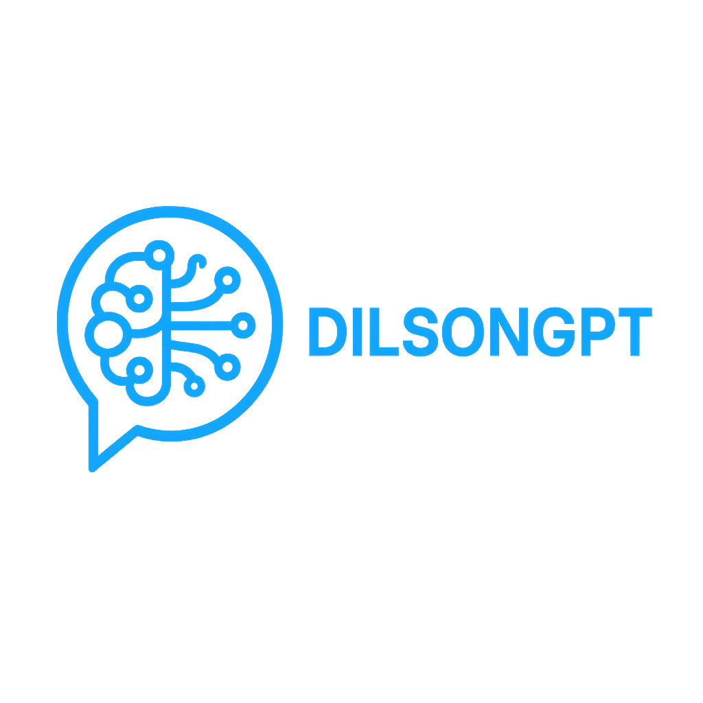

<p align="center">
  
</p>

<p align="center">
  
  
</p>

# DilsongGPT

**Seu chatbot pessoal, com inteligência de ponta e identidade única.**  
Criado por Dilson – programador visionário em formação, com foco em IA, automação e construção de soluções reais.

---

## 🚀 Tecnologias

- Python 3
- OpenAI GPT API
- HTML/CSS/JS (interface web)
- Git e GitHub
- (opcional) LangChain, Hugging Face

---

## ⚙️ Como rodar localmente

```bash
# Clone o repositório
git clone https://github.com/seu-usuario/dilsongpt.git

# Entre na pasta do projeto
cd dilsongpt

# Execute o chatbot (exemplo)
python main.py
```

---

## 📦 Estrutura Sugerida

```
dilsongpt/
├── main.py
├── README.md
├── requirements.txt
├── assets/
│   └── dilsongpt_logo_github.png
├── modules/
│   ├── chat_engine.py
│   └── utils.py
```

---

## 📄 Licença

Este projeto está sob a **Licença MIT**.  
Criado com 💡 por **Dilson**, baseado no módulo **MACDOW**.

---

**Siga o repositório, use o código e monte sua própria IA personalizada!**
